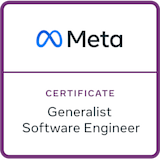
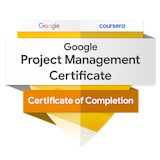
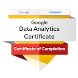

👋 Hello, I'm Pedro. I'm a software developer based in Porto, Portugal.

🚀 My journey as a developer began in 2017, and ever since, I've been on an exhilarating path of learning and growth.

💻 Over the years, I've had the privilege of collaborating with dynamic international teams, contributing to awesome projects such as TUI and DISH. These experiences have not only broadened my technical expertise but also honed my ability to thrive in challenging environments.

🌱 I'm always in pursuit of knowledge and personal growth. Currently, I'm a student at 42 Porto, where I'm engaged in mastering the common core. Additionally, I'm furthering my education by pursuing an academic degree in the field of computer science.

👀 I’m interested in cybersecurity, blockchain, cloud computing, and distributed systems.

<h2 align="center">Skills</h2>

  

<h2 align="center">Certificates</h2>

    

  
<a href="https://certificates.cs50.io/b3f78857-3c42-4fa6-99bc-3ee8fd1158ed.png?size=letter">CS50’s Introduction to Computer Science - <em>HarvardX</em></a>

  
<a href="https://certificates.cs50.io/7155bca1-7aff-4d98-912d-14ec75171685.png?size=letter">CS50’s Web Programming with Python and JavaScript - <em>HarvardX</em></a>

  
<a href="https://www.coursera.org/account/accomplishments/specialization/certificate/J2L79HNTK3CF">Programming with Google Go Specialization - <em>University of California</em></a>

  
<a href="https://www.coursera.org/account/accomplishments/specialization/certificate/SN2MKMGGRKLK">Blockchain Specialization - <em>University at Buffalo</em></a>

  
<a href="https://www.coursera.org/account/accomplishments/specialization/certificate/7RBAURPJFKY2">DevOps on AWS Specialization - <em>AWS</em></a>

  
<a href="https://www.coursera.org/account/accomplishments/specialization/certificate/VMK5GP2W6CA3">Building Cloud Computing Solutions at Scale Specialization - <em>Duke University</em></a>

